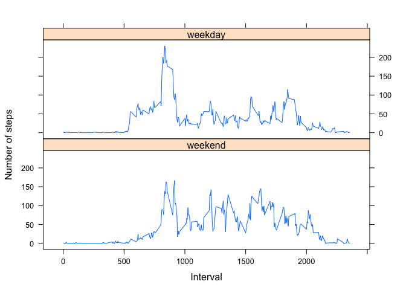

# Analysis of Activity Monitoring Data

## Loading and preprocessing the data. 

The data needs to be unzipped and the csv file read in to the activity variable.
Script dependencies must then be loaded.


```r
#Get Data
unzip("./activity.zip")
activity <- read.csv("./activity.csv")

#Load Dependencies
library(lubridate, quietly = TRUE)
library(plyr, warn.conflicts = FALSE, quietly = TRUE)
library(dplyr, warn.conflicts = FALSE, quietly = TRUE)
```

Let's look at the beginning of the data set to see what we are working with:


```r
str(activity)
```

```
## 'data.frame':	17568 obs. of  3 variables:
##  $ steps   : int  NA NA NA NA NA NA NA NA NA NA ...
##  $ date    : Factor w/ 61 levels "2012-10-01","2012-10-02",..: 1 1 1 1 1 1 1 1 1 1 ...
##  $ interval: int  0 5 10 15 20 25 30 35 40 45 ...
```

```r
head(activity, n = 15)
```

```
##    steps       date interval
## 1     NA 2012-10-01        0
## 2     NA 2012-10-01        5
## 3     NA 2012-10-01       10
## 4     NA 2012-10-01       15
## 5     NA 2012-10-01       20
## 6     NA 2012-10-01       25
## 7     NA 2012-10-01       30
## 8     NA 2012-10-01       35
## 9     NA 2012-10-01       40
## 10    NA 2012-10-01       45
## 11    NA 2012-10-01       50
## 12    NA 2012-10-01       55
## 13    NA 2012-10-01      100
## 14    NA 2012-10-01      105
## 15    NA 2012-10-01      110
```

The interval variable doesn't seem particularly useful in its current format
since it is supposed to indicate a timepoint. Let's create a new time variable 
using today as the origin date as well as merge date and interval to create a 
new datetime variable.


```r
time <- paste(sprintf("%04s", activity$interval), "00", sep = "")
#activity$time <- strptime(time, "%H%M")
activity$time <- as.POSIXct(time, origin = date(), format = "%H%M")
activity$datetime <- paste(activity$date, time, sep = " ") %>%
                     ymd_hms(activity$datetime)
head(activity)
```

```
##   steps       date interval                time            datetime
## 1    NA 2012-10-01        0 2015-01-15 00:00:00 2012-10-01 00:00:00
## 2    NA 2012-10-01        5 2015-01-15 00:05:00 2012-10-01 00:05:00
## 3    NA 2012-10-01       10 2015-01-15 00:10:00 2012-10-01 00:10:00
## 4    NA 2012-10-01       15 2015-01-15 00:15:00 2012-10-01 00:15:00
## 5    NA 2012-10-01       20 2015-01-15 00:20:00 2012-10-01 00:20:00
## 6    NA 2012-10-01       25 2015-01-15 00:25:00 2012-10-01 00:25:00
```

There are also a lot of NAs in the data frame. We will leave them alone for now
but may need to address this issue later.

## What is mean total number of steps taken per day?

Ignoring intervals where there is no data, let's look at a histogram of the
total number of steps taken each day:

```r
day.steps <- ddply(activity, .(date), summarize, sum(steps))
names(day.steps)[2] <- "totalsteps"
hist(day.steps[, 2], main = "Total Steps", xlab = "Steps Per Day")
```

 

This individual appears to take an average of 11,000 steps per day. The actual 
mean number of steps per day is:


```r
with(day.steps, mean(totalsteps, na.rm = TRUE))
```

```
## [1] 10766.19
```

and the median number of steps per day is:


```r
with(day.steps, median(totalsteps, na.rm = TRUE))
```

```
## [1] 10765
```

That is a lot of steps! This must be one active subject.

## What is the average daily activity pattern?

Let's now look at the average number of steps taken, averaged across all days.  
For now we will ignore any NA values:


```r
int.steps <- ddply(activity, .(interval), summarize, mean(steps, na.rm = TRUE))
names(int.steps)[2] <- "avgSteps"
plot(unique(activity$time), int.steps$avgSteps, 
     type = "l", 
     main = "Time Series Plot", 
     xlab = "24 Hr Time",
     ylab = "Average Number of Steps")
```

 

It looks like the subject takes the most steps around 9:00 am. Let's find out
exactly which interval contains the maximum number of steps on average:


```r
max.steps <- filter(int.steps, avgSteps == max(avgSteps))
max.steps[1, 1]
```

```
## [1] 835
```

Looks like we weren't too far off -- the 835 interval contains 
the maximum number (206) of steps on average.

At the beginning we saw that there are a number of days/intervals where there 
are missing values. In fact there are 2304 rows in the
data with missing values. The presence of missing days may introduce bias into 
some calculations or summaries of the data.

Rather than ignore the missing data, let's replace them with the mean (rounded 
to the nearest whole number) for that 5-minute interval across all days.


```r
adj.activity <- arrange(merge(int.steps, activity), datetime)
loc.NA <- which(is.na(adj.activity$steps))
adj.activity[loc.NA, 3] <- round(adj.activity[loc.NA, 2]) 
adj.activity <- select(adj.activity, steps, date, interval, time, datetime)
```

The beginning of the adjusted data set now looks like:


```r
head(adj.activity, n = 15)
```

```
##    steps       date interval                time            datetime
## 1      2 2012-10-01        0 2015-01-15 00:00:00 2012-10-01 00:00:00
## 2      0 2012-10-01        5 2015-01-15 00:05:00 2012-10-01 00:05:00
## 3      0 2012-10-01       10 2015-01-15 00:10:00 2012-10-01 00:10:00
## 4      0 2012-10-01       15 2015-01-15 00:15:00 2012-10-01 00:15:00
## 5      0 2012-10-01       20 2015-01-15 00:20:00 2012-10-01 00:20:00
## 6      2 2012-10-01       25 2015-01-15 00:25:00 2012-10-01 00:25:00
## 7      1 2012-10-01       30 2015-01-15 00:30:00 2012-10-01 00:30:00
## 8      1 2012-10-01       35 2015-01-15 00:35:00 2012-10-01 00:35:00
## 9      0 2012-10-01       40 2015-01-15 00:40:00 2012-10-01 00:40:00
## 10     1 2012-10-01       45 2015-01-15 00:45:00 2012-10-01 00:45:00
## 11     0 2012-10-01       50 2015-01-15 00:50:00 2012-10-01 00:50:00
## 12     0 2012-10-01       55 2015-01-15 00:55:00 2012-10-01 00:55:00
## 13     0 2012-10-01      100 2015-01-15 01:00:00 2012-10-01 01:00:00
## 14     1 2012-10-01      105 2015-01-15 01:05:00 2012-10-01 01:05:00
## 15     0 2012-10-01      110 2015-01-15 01:10:00 2012-10-01 01:10:00
```

The histogram for the total number of steps taken each day now looks like:


```r
adj.daysteps <- ddply(adj.activity, .(date), summarize, sum(steps))
names(adj.daysteps)[2] <- "totalsteps"
hist(adj.daysteps[, 2], main = "Adjusted Total Steps", xlab = "Total Steps")
```

 

The scale on the y-axis has changed from 25 to 35, suggesting there are ~10 more
days with 10,000 - 15,000 steps. Have the mean and median changed though?

The mean for the adjusted data is:


```r
mean(adj.daysteps$totalsteps)
```

```
## [1] 10765.64
```

and the median for hte adjusted data is:


```r
median(adj.daysteps$totalsteps)
```

```
## [1] 10762
```

The values have decreased slightly from the original data. The mean has 0.005% 
fewer steps and the median has 0.028% fewer steps. Ultimately, it appears
that the data is not biased by the missing values. 

## Are there differences in activity patterns between weekdays and weekends?

First we need to classify the dates as belonging to the weekday or the weekend:


```r
adj.activity$type.day <- factor(wday(adj.activity$datetime, label = TRUE) %in% 
                                c("Sat", "Sun"), 
                                levels = c("TRUE", "FALSE"), 
                                labels = c("weekend", "weekday"))
```

Now let's plot the average number of steps taken for weekdays or weekends vs.
the 5-minute interval:


```r
week.activity <- ddply(adj.activity, .(interval, type.day), summarize, mean(steps))
week.activity$time <- unique(adj.activity$time)
names(week.activity)[3] <- "avgSteps"

library(lattice)
xyplot(avgSteps ~ interval | type.day, 
       data = week.activity, 
       layout = c(1,2), 
       type = "l", 
       xlab = "Interval", 
       ylab = "Number of steps")
```

 

It appears that the subject walks more in the mornings on the weekday but less 
during the day, while on weekends the periods of walking is more uniform 
throughout the day.
